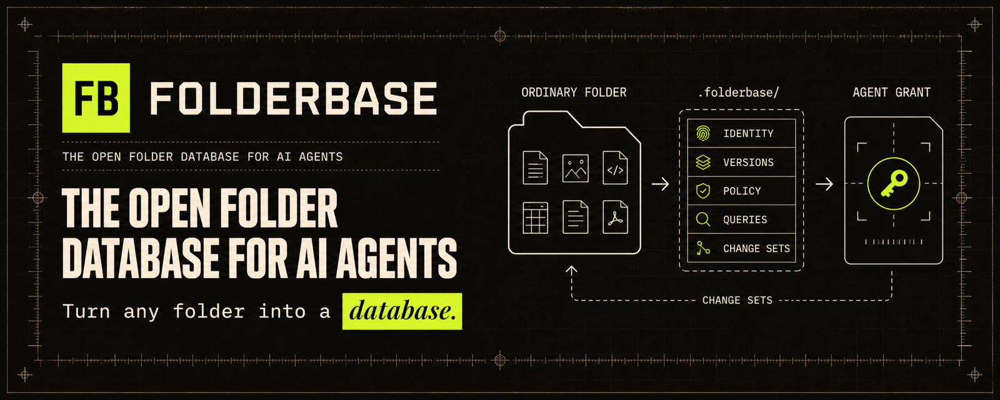

<p align="center">
  <a href="https://folderbase.ai">
    
  </a>
</p>

<p align="center">
  <strong>The open folder database for AI agents.</strong><br>
  Turn any ordinary folder into a structured, versioned workspace without moving or replacing its files.
</p>

<p align="center">
  <a href="LICENSE"></a>
  
  <a href="https://github.com/chalkagents/folderbase/releases/latest"></a>
  <a href="https://www.npmjs.com/package/@folderbase/cli"></a>
  <a href="https://www.npmjs.com/package/@folderbase/sdk"></a>
  <a href="https://crates.io/crates/folderbase-cli"></a>
  
  <a href="https://github.com/chalkagents/folderbase/actions/workflows/ci.yml"></a>
</p>

Folderbase turns an ordinary folder into a structured, versioned workspace that
humans and agents can understand and operate across sessions. Files remain
normal files. A small `.folderbase/` directory adds the durable identity,
protocol records, history, and policy needed to treat the folder as a database.

> **Folderbase is in Beta.** The product, documentation, and optional
> capabilities are still evolving. Compatibility Contract v1 remains the
> deliberately stable integration boundary; features outside that named
> contract must be discovered and pinned explicitly.

Folderbase is the open database core beneath
[Folderbase Cloud](https://folderbase.ai), in the same way that PostgreSQL is
the open database beneath managed platforms. The core works locally and does
not require a Folderbase account.

## Start in 60 seconds

From any folder, with Node.js 22.14 or newer:

```sh
cd /path/to/your-folder
npx --yes @folderbase/cli init . --json
npx --yes @folderbase/cli validate . --json
```

Initialization is additive. It leaves every existing file at its ordinary path
and creates the minimum engine-owned state:

```text
your-folder/
├── .folderbase/
│   └── manifest.json
└── …your existing repositories, documents, media, and data
```

That folder now has a durable Folderbase ID and a machine-readable contract
that Codex, Claude, remote VMs, scripts, and apps can discover locally. It is
still a normal folder: existing editors, terminals, Git workflows, and native
file tools continue to work.

## Install

Use `npx` for a zero-setup invocation, including inside a remote agent VM:

```sh
npx --yes @folderbase/cli init .
```

Install the same native CLI persistently with Homebrew or Cargo:

```sh
brew install chalkagents/tap/folderbase
# or, with Rust 1.96+
cargo install folderbase-cli --version 0.6.1 --locked
```

Prebuilt macOS and Linux binaries and their closed `SHA256SUMS` record are
available from [GitHub Releases](https://github.com/chalkagents/folderbase/releases/latest).
Every channel runs the same released Core executable and Compatibility
Contract. The exact tag, registry identities, checksums, and independent
clean-install commands are recorded in the
[v0.6.1 public distribution evidence](docs/verification/v0.6.1-public-distribution.md).

## Integrate an agent or application

The CLI JSON interface is the universal integration surface. Callers do not
need to link the Rust library or interpret private `.folderbase/` internals:

```sh
folderbase protocol contract --json
folderbase inspect . --json
folderbase workspace list . --json
folderbase validate . --json
```

Node.js and TypeScript consumers can use the same executable seam without
reimplementing Core process supervision:

```sh
npm install @folderbase/sdk @folderbase/cli
```

```js
import { FolderbaseClient } from "@folderbase/sdk";

const folderbase = new FolderbaseClient();
const contract = await folderbase.contract();
```

The SDK is removable, has no runtime dependencies, bundles no native binary,
and never interprets engine-owned `.folderbase/` records.

Compatibility Contract v1 freezes portable record meanings, Version IDs,
manifest behavior, explicit upgrade behavior, CLI JSON envelopes and exit
meanings. Additive fields may appear, so integrations should ignore unknown
JSON fields. See the [Compatibility Contract](docs/compatibility-v1.md) and
[CLI JSON specification](docs/cli-json-v1.md).

`protocol contract --json` also returns a deterministic optional-capability
inventory. This lets an app, agent, or remote VM require an exact stable or
experimental profile without parsing help text. Verify every advertised known
profile from a source release with:

```sh
node protocol/conformance/capabilities/run.mjs \
  --implementation /path/to/folderbase
```

## Design principles

- **Folders stay folders.** Existing repositories, documents, media, PDFs,
  databases, and other file types keep their ordinary paths and native tools.
- **Agents are first-class users.** Ordinary files remain directly readable,
  while optional `FOLDERBASE.md` context and opt-in `AGENTS.md` or `CLAUDE.md`
  adapters can provide local entry points without becoming authority.
- **Structure is guidance, not a cage.** Templates initialize useful structure
  and can expand over time. Reorganization is explicit, previewable, and
  reversible.
- **Local work is complete work.** Keep-local workspaces remain fully usable
  offline. Cloud availability never silently evicts active files.
- **Sharing is explicit authority.** Folder scopes can be granted to humans or
  agent sessions; nesting and relationships never imply access.
- **Changes preserve evidence.** Local versions, resumable content transfer,
  conflict preservation, and migration rollback protect ongoing work.

## What is included

- `folderbase-core`: Rust library for inspection, initialization, validation,
  templates, migration, local versions, workspace operations, sharing policy,
  canonical bounded-memory transfer planning/source streaming, canonical
  Folderbase Version validation/digests/controlled encoding, read-only
  metadata capture planning, and sync primitives
- `folderbase`: reference command-line interface
- `@folderbase/sdk`: typed Node.js process adapter for CLI JSON and daemon stdio
- metadata-first query/index, additive template expansion, scoped Change Sets,
  exact whole-Version root reconstruction, and root-pinned daemon capability
  profiles
- versioned JSON Schemas and conformance fixtures
- built-in person, organization, customer, engagement, project, temporary, and
  custom templates
- an unmanaged, mixed-file project fixture used for end-to-end migration tests

The commercial desktop app, managed sync service, web workspace, and cloud
agent runtime live in the separate Folderbase Platform repository.

## Trust boundary

`.folderbase/` is engine-owned local database state, analogous to `.git/`.
Local Core treats internally consistent records there as trusted state. It
still fails closed on malformed or partial records, interrupted writes,
ordinary concurrent races, path or inode substitution, unexpected hard links,
and any operation that would overwrite existing workspace content.

Local Core does not claim cryptographic authenticity against a local process
running as the same user that deliberately rewrites every related
`.folderbase/` record into one internally consistent forgery. Protecting local
state from that actor would require an OS-protected device key and a larger key
recovery UX, which is intentionally outside the KISS local protocol. Folderbase
Cloud and server-side sharing authority are separate authenticated trust
domains; local metadata possession alone never grants Cloud access.

Nested traversal recognizes only the exact, no-follow
`.folderbase/manifest.json` regular-file marker as an opaque boundary; it does
not decode the nested bytes through the parent. Markerless `.folderbase` state
and optional context are inert. Case aliases and symlink or wrong-type marker
shapes gain no authority: read-only analysis may quarantine them as
`Unchecked` (`unchecked` on the wire) and omit descendants, while
materialization, mutation, transfer, and restore operations reject them.

## Turn a folder into a Folderbase

Inspect first. Inspection reads metadata and boundaries without changing the
folder:

```sh
folderbase inspect /path/to/project --json
```

Preview the additive initialization:

```sh
folderbase init /path/to/project --dry-run --json
```

The JSON plan includes a stable Core-owned `plan_digest`. To bind approval to
the exact reviewed request, template, protocol writes, boundaries, and visible
destination state, apply with that digest:

```sh
folderbase init /path/to/project \
  --expected-plan-digest DIGEST_FROM_DRY_RUN \
  --json
folderbase validate /path/to/project --json
```

After a captured deletion, restore the current Local Head's exact ordinary-file
Tombstone without overwriting anything already at that path:

```sh
folderbase version restore-tombstone /path/to/project path/to/file --json
```

This restores the sealed opaque bytes and executable fidelity under the
original Object ID and Object Version, then creates one new full-state
Folderbase Version. Directory and symlink Tombstones are not restored by v1.

An independently produced, package-pinned full Version can reconstruct one
absent ordinary root through the advertised stable
`folderbase.root-reconstruction@0.1.0` capability:

```sh
folderbase reconstruct \
  /absolute/path/to/reconstruction-package \
  /absolute/path/to/new-folderbase \
  --stdin --json < request.json
```

The request binds one operation ID and the exact package-index SHA-256. Core
verifies every opaque object, restores all supported file types without
interpreting them, retains restorable Tombstone history, and publishes the
destination with no-clobber semantics. Source and destination authorities must
be absolute and physically separate. See the
[root reconstruction capability](protocol/capabilities/root-reconstruction/0.1.0/README.md)
for the closed package and process contracts.

The CLI asks Core for one plan. Apply carries the opaque digest from that plan;
Core compares it and performs a bounded, metadata-only preflight immediately
before its first write. The digest includes the physical filesystem identity of
the reviewed root, so replacing a folder with a same-path, same-shape folder in
another process is stale. New paths, kind changes, boundary changes, or planned
target collisions also return a typed stale-plan error with no protocol writes.
Content edits to ordinary preserved files do not create approval churn because
Core never writes those files. `folderbase init /path/to/project` remains
available for direct, single-step initialization.

This is optimistic concurrency, not atomic filesystem isolation. A race after
preflight is contained by root-capability traversal, no-follow parent opens,
and per-write no-clobber installation; competing bytes are preserved and the
operation fails rather than overwriting them.

Native protocol 0.5 initialization leaves the original files in place and
creates only the machine-readable manifest by default:

```text
project/
├── .folderbase/
│   └── manifest.json
└── …your existing files
```

Root `FOLDERBASE.md` is fully ordinary optional content. Root
`.folderbaseignore` is optional user-owned capture-policy input: when present
it is bounded, force-captured, and changed through typed policy-aware flows.
Agent adapters are opt-in and are never independent authority.

For a disorganized or multi-boundary folder, use the migration workflow. It
analyzes the folder, asks bounded questions, produces a reviewable plan, and
does not apply it unless explicitly approved:

```sh
folderbase migrate /path/to/project --destination Organized
```

## Work with files

The workspace interface lists ordinary files while keeping protocol state,
repository internals, and reconstructable dependency trees out of agent
context:

```sh
folderbase workspace list /path/to/project --json
folderbase workspace read /path/to/project README.md --json
```

Text saves use an expected SHA-256 so stale agent sessions cannot silently
overwrite newer work:

```sh
printf '%s' "$UPDATED_TEXT" | folderbase workspace save \
  /path/to/project README.md \
  --expected-sha256 "$LOADED_SHA256" \
  --stdin \
  --json
```

Binary and very large files remain part of the workspace. Agents can inspect
their metadata first; transformations operate with streaming and
content-addressed chunks rather than loading entire files into model context.
Core opens a transfer source by immutable `VersionId`, never by the mutable
workspace path. The source binds a canonical manifest to that exact
content-addressed blob and emits a verification receipt only after an exact
chunk range has been streamed and checked.

## Protocol

- [Domain language](CONTEXT.md)
- [Compatibility Contract v1](docs/compatibility-v1.md)
- [Stable CLI JSON v1](docs/cli-json-v1.md)
- [Protocol specification](docs/protocol-spec.md)
- [Template protocol](docs/template-protocol.md)
- [Reorganization Protocol 0.3](docs/reorganization-protocol.md)
- [Proposed Reorganization Plan decision](docs/adr/0002-evolve-existing-folderbases-through-reorganization-plans.md)
- [Schemas, templates, and conformance vectors](protocol/README.md)
- [Accepted canonical streaming-transfer decision](docs/adr/0001-stream-immutable-versions-through-canonical-manifests.md)
- [Accepted bounded full-state Folderbase Version decision](docs/adr/0004-seal-portable-folderbase-versions-as-bounded-full-state.md)
- [Proposed metadata-first capture transaction](docs/adr/0005-plan-capture-before-sealing-or-moving-local-head.md)
- [Accepted ordinary-folder and optional-narrative decision](docs/adr/0006-version-ordinary-folder-roots-and-optional-narratives.md)
- [Proposed durable migration transaction module](docs/adr/0007-execute-migrations-through-one-durable-transaction-module.md)
- [Accepted native distribution decision](docs/adr/0008-distribute-native-core-through-thin-installers.md)
- [Accepted minimal compatibility decision](docs/adr/0009-freeze-the-minimal-core-compatibility-contract.md)
- [Accepted optional-capability discovery decision](docs/adr/0010-discover-optional-capabilities-without-expanding-base-v1.md)

Cargo packages remain below 1.0, but the surfaces named by Compatibility
Contract v1 are stable. Experimental surfaces may change between minor Cargo
versions. Breaking the named portable records, identifiers, CLI JSON fields,
exit meanings, or conformance behavior requires a new compatibility contract.

## Implement Folderbase in another language

The public fixture suite is the authority—not this Rust implementation. A Go,
TypeScript, or other independent implementation can run the same conformance
runner against its executable:

```sh
node protocol/conformance/cli-json-v1/run.mjs \
  --implementation /path/to/your/folderbase
```

The suite checks the stable CLI contract and portable protocol fixtures without
using Rust internals. Passing it demonstrates behavioral compatibility with
Folderbase Compatibility Contract v1.

## Product boundaries

This repository is the Apache-2.0 **Folderbase Database Core**: the portable
protocol, reference engine, CLI, schemas, fixtures, and conformance suite.

The commercial **Folderbase App** provides the Better Finder experience and
the reliable local-to-cloud bridge. **Folderbase Cloud** hosts, syncs, and
shares live Folderbases with scoped permissions for humans and agents.
**Folderbase Cloud Agents** will run agent sessions against ordinary Folderbase
workspaces and return reviewable changes. Cloud authority and sync behavior are
not invented or implied by local Core records.

## Development

```sh
cargo fmt --all -- --check
cargo clippy --workspace --all-targets --all-features -- -D warnings
cargo test --workspace --all-features --locked
bash scripts/check-public-eclipse.sh
node scripts/verify-folderbase-version-digest-vectors.mjs
node scripts/verify-folderbase-version-distribution.mjs
node scripts/verify-folderbase-version-0.5-digest-vectors.mjs
node scripts/verify-folderbase-version-0.5-distribution.mjs
node --test scripts/tests/compatibility-contract.test.mjs
cargo build --package folderbase-cli --locked
node protocol/conformance/cli-json-v1/run.mjs \
  --implementation ./target/debug/folderbase
bash scripts/test-package-install.sh
```

See [CONTRIBUTING.md](CONTRIBUTING.md) and
[SECURITY.md](SECURITY.md) before submitting changes or reporting a
vulnerability.

## License

Licensed under the [Apache License 2.0](LICENSE).
